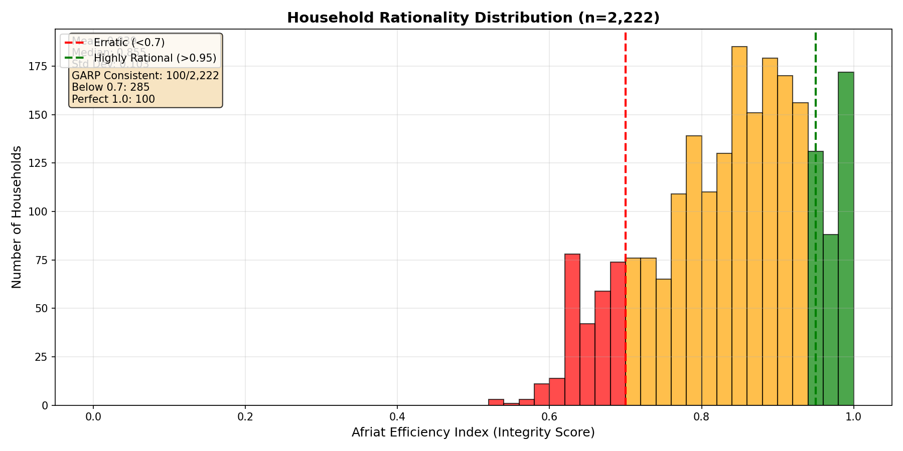
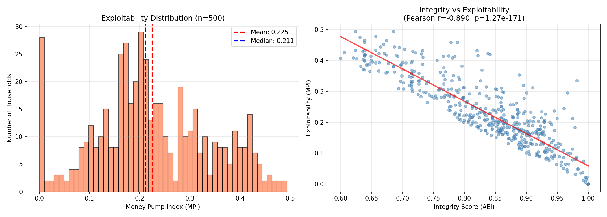
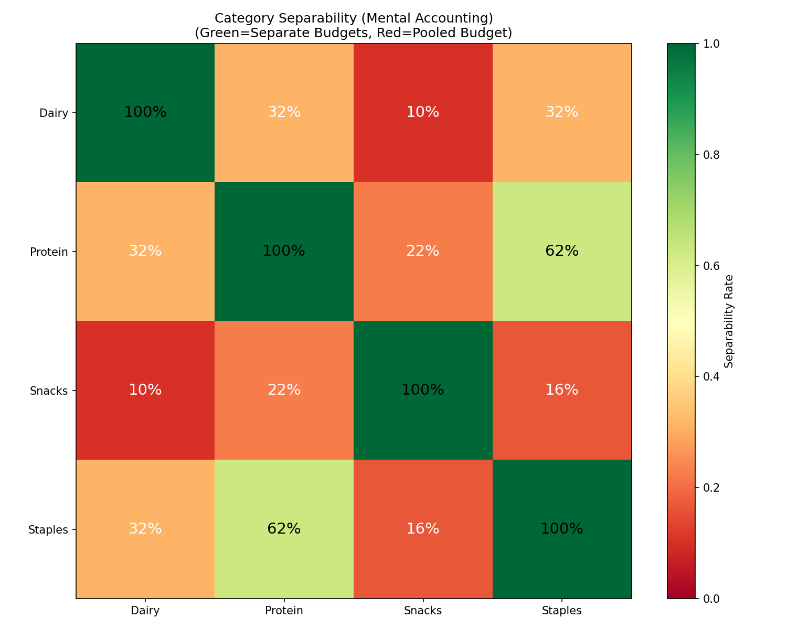
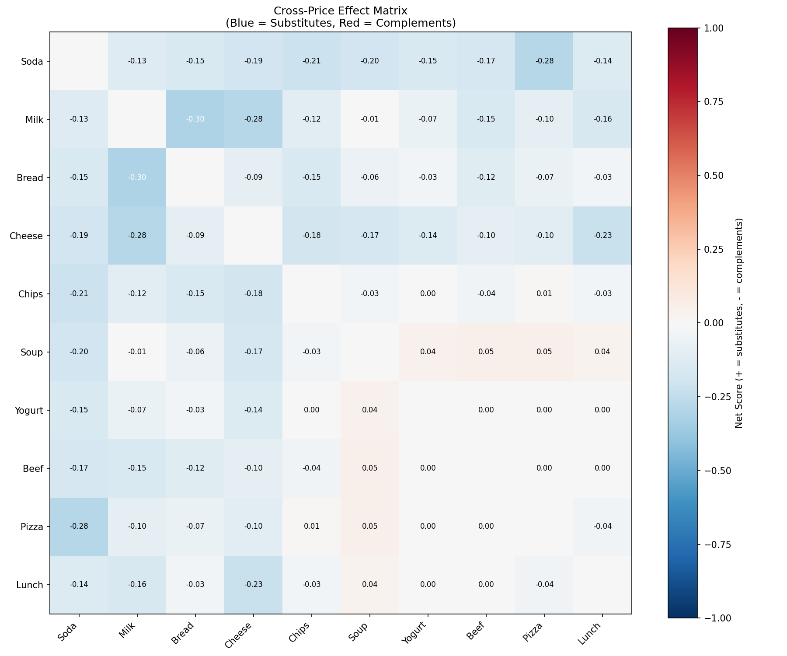
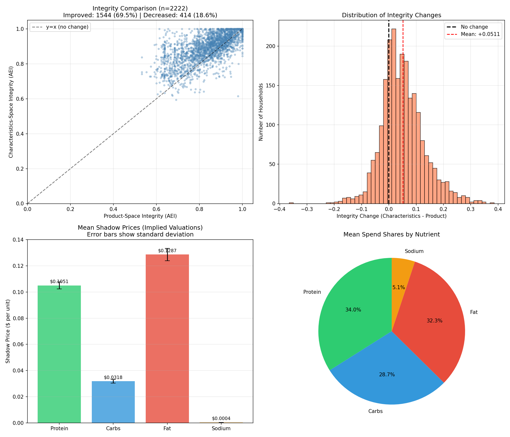
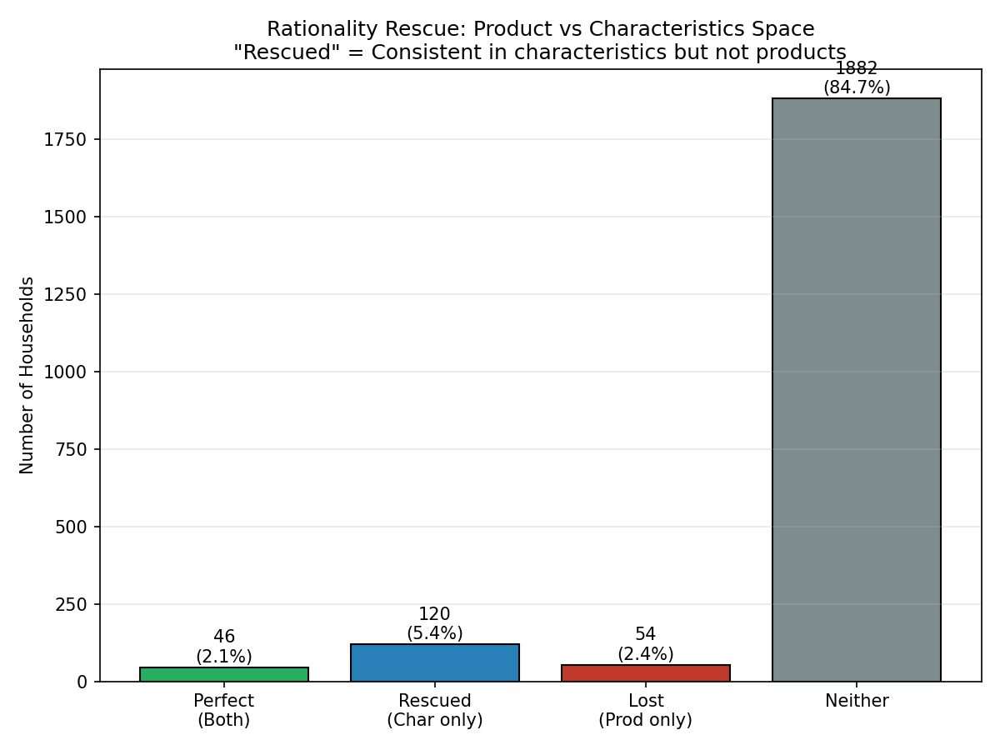

# Case Study: Dunnhumby Consumer Data

Application of PyRevealed to the **Dunnhumby "The Complete Journey"** dataset—2 years of grocery transactions from ~2,500 households.

## Dataset Overview

| Metric | Value |
|--------|-------|
| Households analyzed | 2,222 |
| Product categories | 10 (Soda, Milk, Bread, Cheese, Chips, Soup, Yogurt, Beef, Pizza, Lunchmeat) |
| Time period | 104 weeks (2 years) |
| Total transactions | 645,288 |
| Processing time | 92 seconds |

---

## Results

### Consistency

| Metric | Value | Interpretation |
|--------|-------|----------------|
| **Consistent** | 100 (4.5%) | Only 4.5% of households are perfectly consistent |
| **Mean integrity score** | 0.839 | Most behavior is ~84% consistent |
| **Median integrity score** | 0.855 | Half of households score above 0.855 |
| **Low consistency** (< 0.7) | 285 (12.8%) | 12.8% show significant departures |
| **Perfect consistency** (1.0) | 100 (4.5%) | Preference recovery possible for these |

Most households cluster around 0.85 integrity:



### Exploitability (Confusion Metric)

How much could be extracted from users via arbitrage on their inconsistencies?



Mean confusion metric: 0.225. Strong negative correlation with integrity (r=-0.89).

### Mental Accounting (Feature Independence)

Do households treat product groups as separate budgets?



Only Protein (Beef, Lunchmeat) vs Staples (Bread, Soup) shows separate budgeting (62%). All other category pairs: pooled budgets (<35%).

### Auto-Discovered Product Groups

Does the data confirm our manual category groupings? Using `discover_independent_groups()`:

| Manual Group | Products | Auto-Discovery Agreement |
|--------------|----------|-------------------------|
| **Dairy** | Milk, Cheese, Yogurt | 61% ✓ |
| **Snacks** | Soda, Chips, Pizza | 60% ✓ |
| **Staples** | Bread, Soup | 71% ✓ |
| **Protein** | Beef, Lunchmeat | 42% ✗ |

Three of four manual groupings confirmed. Protein products don't cluster as strongly as expected.

### Robustness (Outlier Fraction)

How many observations need to be removed to make behavior consistent?

| Metric | Value |
|--------|-------|
| Mean outlier fraction | 18.6% |
| Perfect consistency (0%) | 3.8% |
| Easy fixes (<10%) | 17.0% |
| Integrity-Outlier correlation | -0.499 |

17% of households are "almost consistent"—removing <10% of their observations makes them fully consistent.

### Preference Structure Tests

| Test | Result | Interpretation |
|------|--------|----------------|
| **Test Power** | 0.845 (87.5% significant) | Consistency test has high statistical power |
| **Proportional Scaling** | 3.2% pass | Few scale preferences with budget |
| **Income Invariance** | 0% pass | All show income effects |
| **Per-Obs Efficiency** | 0.534 mean | Granular efficiency per observation |

### Cross-Price Relationships

| Product Pair | Score | Relationship |
|--------------|-------|--------------|
| Milk & Bread | -0.31 | Complements |
| Soda & Pizza | -0.29 | Complements |
| Milk & Cheese | -0.29 | Complements |
| Cheese & Lunchmeat | -0.23 | Complements |
| Soda & Chips | -0.22 | Complements |

Most product pairs show complementary relationships (bought together), consistent with grocery shopping patterns.



### Predictive Validation

Can first-half behavior predict second-half outcomes? Split-sample study with LightGBM:

| Target | Persistence RMSE | LightGBM RMSE | R² | Improvement |
|--------|------------------|---------------|-----|-------------|
| **Integrity** | 0.114 | 0.081 | 0.084 | **28.4%** |
| **Total Spending** | 195.78 | 195.03 | 0.785 | 0.4% |
| **Category Shares** | 0.06-0.09 | 0.06-0.09 | 0.33-0.55 | 1-5% |

**Ablation Study: Incremental Value of PyRevealed Features**

| Feature Set | Integrity R² | Spending R² |
|-------------|--------------|-------------|
| Basic only (14 features) | 0.071 | 0.784 |
| Basic + PyRevealed (24 features) | **0.084** | 0.785 |
| **PyRevealed R² lift** | **+0.014** | +0.001 |

PyRevealed features (BehavioralAuditor + PreferenceEncoder) contribute **12.5% of total feature importance** for integrity prediction.

### Lancaster Characteristics Model

Applying the Lancaster model to transform product-space behavior into characteristics-space using nutritional attributes (Protein, Carbs, Fat, Sodium per typical serving).

| Metric | Product Space | Characteristics Space | Change |
|--------|---------------|----------------------|--------|
| **Mean integrity** | 0.839 | 0.890 | **+5.1%** |
| **Consistent** | 100 (4.5%) | 166 (7.5%) | +66% |

**"Rationality Rescue"**: 120 households (5.4%) are consistent in characteristics-space but not product-space—they're optimizing for *nutrients*, not specific products.



**Shadow Prices** (implied valuations per unit):

| Nutrient | $/unit | Spend Share |
|----------|--------|-------------|
| Protein | $0.105/g | 34.0% |
| Fat | $0.129/g | 32.3% |
| Carbs | $0.032/g | 28.7% |
| Sodium | $0.0004/mg | 5.1% |

Fat and Protein command the highest implicit prices, suggesting households value calorie-dense macronutrients.



#### Interpretation

When we analyze grocery shopping at the **product level**, only 4.5% of households appear perfectly rational. Many seem to make contradictory choices—buying expensive products when cheaper alternatives were available.

But people don't think about "products"—they think about what products *deliver*. A household isn't choosing between "Beef" and "Yogurt"; they're choosing between protein sources, balancing macronutrients, or optimizing calories per dollar.

When we transform to **nutritional characteristics**, the picture changes: consistency jumps from 0.839 to 0.890. The 120 "rescued" households looked irrational in product-space but are perfectly consistent about *nutrients*—they'll substitute freely between products delivering similar nutritional profiles.

The shadow prices reveal implicit valuations: Fat and Protein command ~$0.11-0.13/g while Carbs are only $0.03/g. Households optimize for calorie-dense, satiating macronutrients.

**Practical implication**: Those 120 rescued households are prime candidates for store-brand substitution—they care about nutrition, not labels. The 18.6% whose consistency *decreased* are the opposite: brand loyalists who'll pay premiums regardless of nutritional equivalence.

---

## Key Insights

| Category | Finding |
|----------|---------|
| **Consistency** | 4.5% consistent, mean integrity = 0.839 |
| **Exploitability** | Mean confusion = 0.225 |
| **Statistical Power** | Test power = 0.845 (87.5% significant) |
| **Preference Structure** | 3.2% proportional-scaling, 0% income-invariant |
| **Feature Independence** | Only Protein vs Staples shows separate budgets (62%) |
| **Robustness** | 17% "almost consistent" (outlier fraction < 0.1) |
| **Cross-Price** | Mostly complements (Milk+Bread, Soda+Pizza) |
| **Prediction** | PyRevealed features: +0.014 R² lift (12.5% importance) |
| **Lancaster Model** | 5.4% "rescued" in characteristics-space, +5.1% mean integrity |

---

## Running the Analysis

```bash
# 1. Download the Kaggle dataset (requires kaggle CLI)
cd dunnhumby && ./download_data.sh

# 2. Run the full integration test suite
python3 dunnhumby/run_all.py

# 3. Run extended analysis (income, spending, time trends)
python3 dunnhumby/extended_analysis.py

# 4. Run comprehensive analysis (confusion, separability)
python3 dunnhumby/comprehensive_analysis.py

# 5. Run advanced analysis (complementarity, mental accounting, stress test)
python3 dunnhumby/advanced_analysis.py

# 6. Run encoder analysis (auto-discovery, outlier fraction)
python3 dunnhumby/encoder_analysis.py

# 7. Run predictive validation (split-sample LightGBM)
python3 dunnhumby/predictive_analysis.py

# 8. Run new algorithms analysis (test power, proportional scaling, etc.)
python3 dunnhumby/new_algorithms_analysis.py

# 9. Run Lancaster characteristics model (nutritional analysis)
python3 dunnhumby/lancaster_analysis.py

# Optional: Quick test mode (100 households sample)
python3 dunnhumby/run_all.py --quick
```
