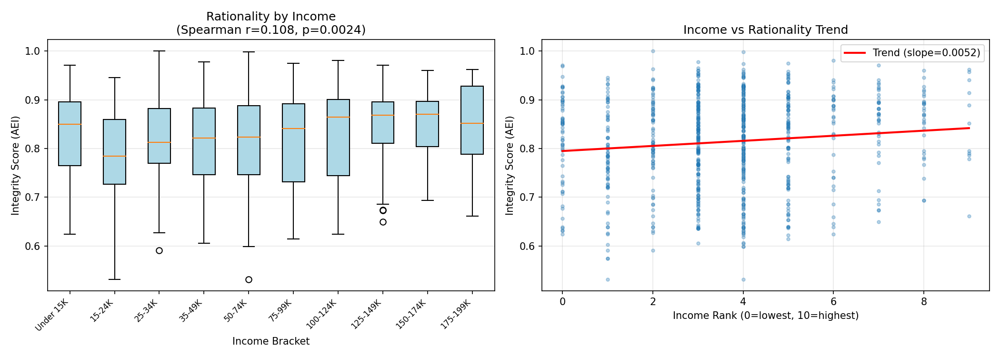
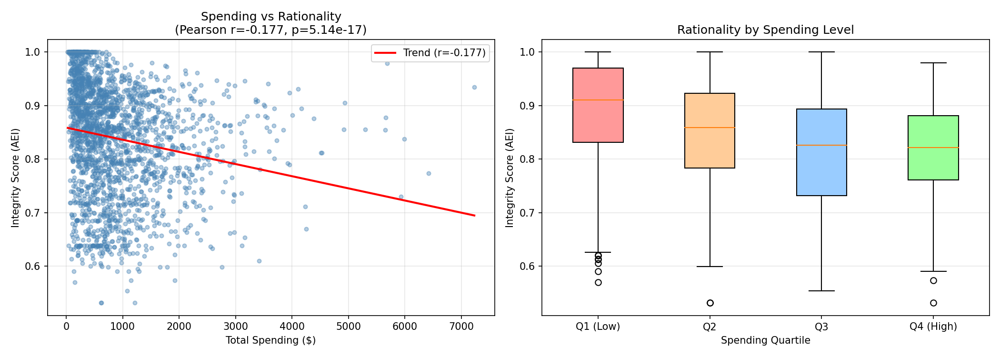
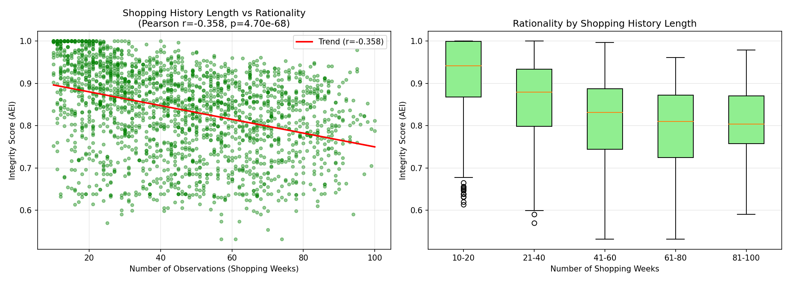
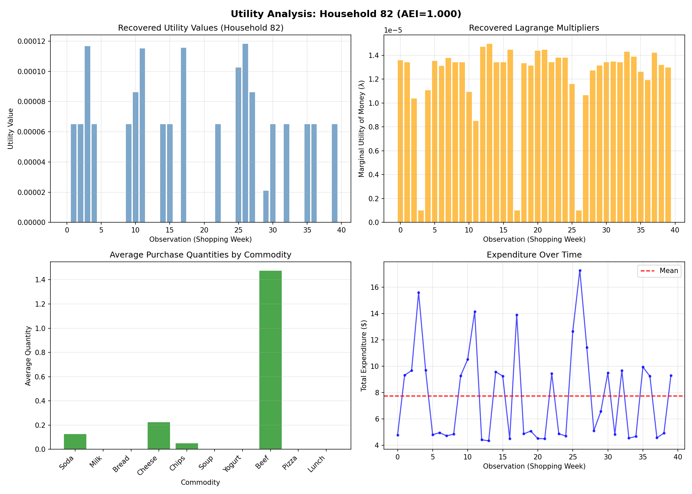
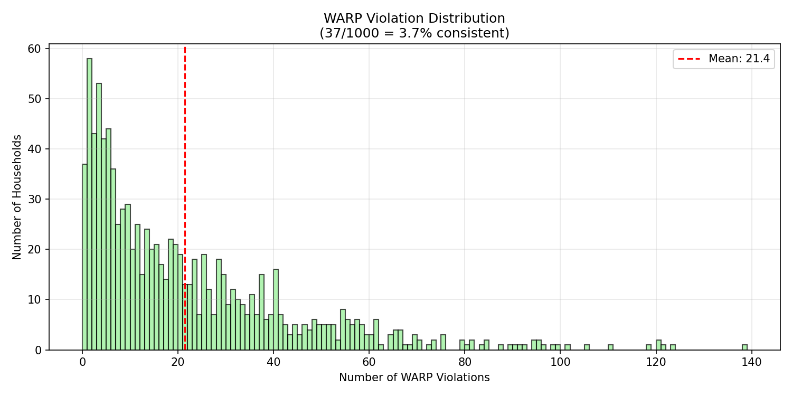
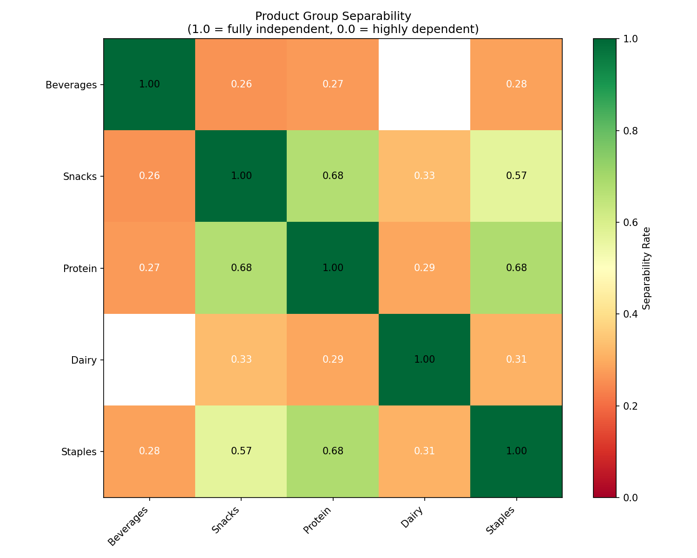
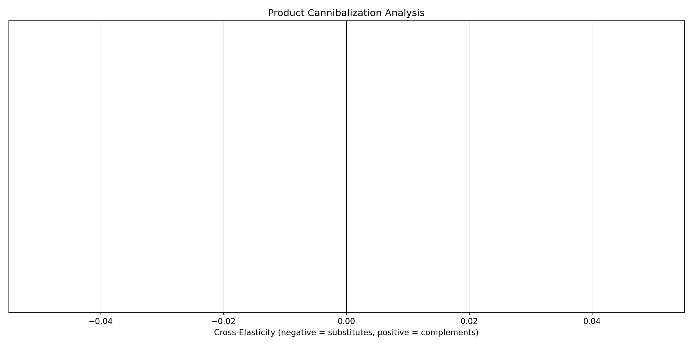
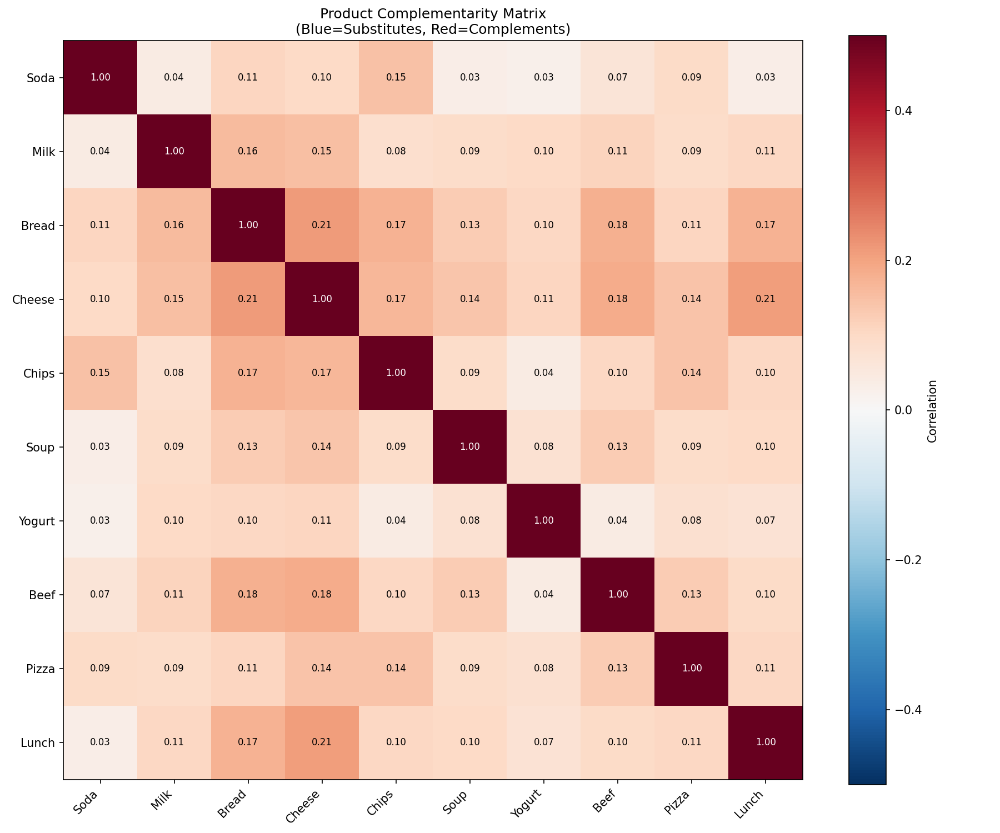
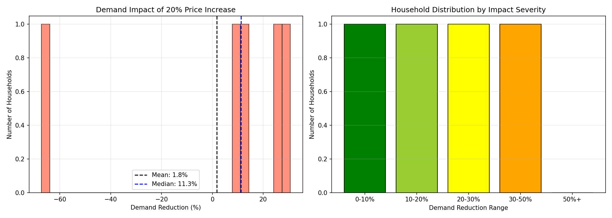
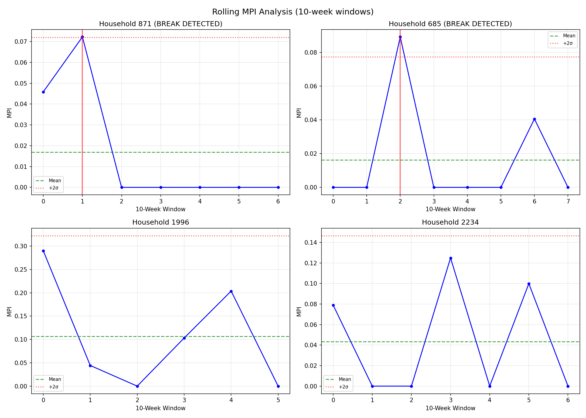

# PyRevealed

**Behavioral Signal Analysis for User Understanding**

Detect bots, shared accounts, and UI confusion using structural consistency checks on user behavior logs.

## What is this?

PyRevealed is a **Structural Anomaly Detection** library for user behavior.

Standard ML models assume user data is valid. But what if users are:
- **Bots** generating random clicks?
- **Shared accounts** with multiple conflicting preferences?
- **Confused users** making exploitable decisions due to bad UX?

This package answers three questions:
1. **Is this user consistent?** → Detects bots and fraud
2. **What drives their decisions?** → Extracts latent preferences for ML features
3. **How confused are they?** → Flags bad UX via exploitable inconsistencies

## Installation

```bash
pip install pyrevealed
```

For visualization support:
```bash
pip install pyrevealed[viz]
```

## Quick Start

### The Auditor: Validate User Behavior

```python
from pyrevealed import BehavioralAuditor, BehaviorLog
import numpy as np

# Create behavior log from user's historical actions
log = BehaviorLog(
    cost_vectors=np.array([      # What the user paid (T x N matrix)
        [1.0, 2.0],              # Observation 0: cost of action A=1, B=2
        [2.0, 1.0],              # Observation 1: cost of action A=2, B=1
    ]),
    action_vectors=np.array([    # What the user did (T x N matrix)
        [3.0, 1.0],              # Observation 0: did 3 of A, 1 of B
        [1.0, 3.0],              # Observation 1: did 1 of A, 3 of B
    ]),
    user_id="user_123"
)

# Run behavioral audit
auditor = BehavioralAuditor()

# Bot detection: Is this user behaving consistently?
if not auditor.validate_history(log):
    print("Warning: Inconsistent behavior detected")

# Data quality: How clean is the behavioral signal?
integrity = auditor.get_integrity_score(log)
print(f"Integrity Score: {integrity:.2f}")  # 1.0 = perfect, <0.85 = suspicious

# UX check: Is the user confused/exploitable?
confusion = auditor.get_confusion_score(log)
print(f"Confusion Score: {confusion:.2f}")  # 0.0 = clear-headed, >0.2 = confused
```

### The Encoder: Extract Features for ML

```python
from pyrevealed import PreferenceEncoder, BehaviorLog

# Fit encoder to user behavior
encoder = PreferenceEncoder()
encoder.fit(log)

# Extract latent preference values as ML features
latent_values = encoder.extract_latent_values()
print(f"Latent values: {latent_values}")

# Predict what user would do under new conditions
new_costs = np.array([1.5, 2.5])
predicted_action = encoder.predict_choice(new_costs, resource_limit=100.0)
```

### Full Audit Report

```python
# Get comprehensive risk assessment
report = auditor.full_audit(log)

print(f"Consistent: {report.is_consistent}")
print(f"Integrity:  {report.integrity_score:.2f}")
print(f"Confusion:  {report.confusion_score:.2f}")
print(f"Bot Risk:   {report.bot_risk:.2f}")
print(f"Shared Account Risk: {report.shared_account_risk:.2f}")
print(f"UX Confusion Risk:   {report.ux_confusion_risk:.2f}")
```

## API Reference

### High-Level Classes

| Class | Description |
|-------|-------------|
| `BehavioralAuditor` | Validates behavior consistency (the "linter" for user data) |
| `PreferenceEncoder` | Extracts latent preferences (sklearn-style API) |
| `AuditReport` | Comprehensive audit results with risk scores |

### Data Containers

| Class | Description |
|-------|-------------|
| `BehaviorLog(cost_vectors, action_vectors, user_id)` | User behavior history |
| `RiskChoiceLog(safe, risky_outcomes, probs, choices)` | Choices under uncertainty |
| `EmbeddingChoiceLog(item_features, choice_sets, choices)` | Choices in feature space |

### Core Functions

| Function | Description |
|----------|-------------|
| `validate_consistency(log)` | Check if behavior is internally consistent |
| `compute_integrity_score(log)` | Score from 0 (chaotic) to 1 (consistent) |
| `compute_confusion_metric(log)` | Measure exploitable inconsistencies |
| `fit_latent_values(log)` | Extract latent preference values |
| `find_preference_anchor(log)` | Find ideal point in embedding space |
| `test_feature_independence(log, group_a, group_b)` | Test if feature groups are independent |

### Specialized Analysis

| Function | Description |
|----------|-------------|
| `compute_risk_profile(log)` | Analyze risk preferences |
| `discover_independent_groups(log)` | Auto-discover separable feature groups |
| `compute_cross_impact(log, group_a, group_b)` | Measure cross-elasticity between groups |

## How It Works

PyRevealed uses **revealed preference theory** from economics to detect structural anomalies in behavior:

1. **Consistency Check**: If a user prefers A over B, and B over C, they should prefer A over C. Violations indicate noise, confusion, or multiple users.

2. **Integrity Score**: Measures what fraction of behavior is consistent. Perfect consistency = 1.0. Random behavior ≈ 0.5.

3. **Confusion Metric**: Measures how much money could be "pumped" from a user by exploiting their inconsistencies. High values indicate UI-caused confusion.

The math is based on Afriat (1967) and Varian (1982), but you don't need to know economics to use the library.

---

## Empirical Study: Dunnhumby Consumer Data

Analysis of the **Dunnhumby "The Complete Journey"** dataset—2 years of grocery transactions from ~2,500 households.

### Dataset Overview

| Metric | Value |
|--------|-------|
| Households analyzed | 2,222 |
| Product categories | 10 (Soda, Milk, Bread, Cheese, Chips, Soup, Yogurt, Beef, Pizza, Lunchmeat) |
| Time period | 104 weeks (2 years) |
| Total transactions | 645,288 |
| Processing time | 92 seconds |

### Methodology

**Integrity Score (AEI)**: If you bought more apples when they were expensive and fewer when cheap, something's off. The integrity score finds the largest fraction of your choices that could come from a single consistent preference. Score of 1.0 = perfectly consistent; 0.5 = random noise.

**WARP (Weak Axiom)**: Did you ever directly contradict yourself? Example: Bought bundle A when B was cheaper, then bought B when A was cheaper.

**GARP (Generalized Axiom)**: Did you contradict yourself through a chain? Example: Preferred A over B, B over C, but then C over A. GARP catches more violations because it follows transitivity chains.

**Money Pump Index (MPI)**: How much money could a clever salesman extract by exploiting your inconsistencies? If you say A > B > C > A, someone can sell you A for B, B for C, C for A—you end up where you started but poorer. The MPI is the fraction of spending that could be "pumped" this way.

**Separability**: Do you have separate mental budgets for different things? If Dairy and Protein are separable, buying more milk doesn't change how you buy beef. We test whether behavior in group A can be explained independently of group B.

**Structural Breaks**: Did your preferences change over time? We run MPI on rolling 10-week windows. A "break" is a sudden spike in MPI—temporary inconsistency that could indicate a life change, shared account, or external shock.

### Key Findings

| Metric | Value | Interpretation |
|--------|-------|----------------|
| **GARP-consistent** | 100 (4.5%) | Only 4.5% of households are perfectly rational |
| **Mean integrity score** | 0.839 | Most behavior is ~84% consistent |
| **Median integrity score** | 0.855 | Half of households score above 0.855 |
| **Erratic shoppers** (< 0.7) | 285 (12.8%) | These users may confuse A/B tests |
| **Perfect rationality** (1.0) | 100 (4.5%) | Utility recovery possible for these |

### Rationality Distribution

Most households cluster around 0.85 integrity, with a long tail of "erratic shoppers" below 0.70:


### Income vs. Rationality



Spearman r=0.108 (p<0.01).

### Spending vs. Rationality



Pearson r=-0.177 (p<0.001).

### Shopping History vs. Rationality



Pearson r=-0.358 (p<0.001).

### Utility Recovery



### Exploitability Analysis (Money Pump Index)


Mean MPI: 0.225. Integrity-exploitability correlation: r=-0.89.

### WARP vs GARP Consistency



3.7% pass WARP, 4.5% pass GARP.

### Product Group Separability



### Product Cannibalization



### Product Complementarity Matrix

Correlation analysis across all product pairs (300 household sample):



| Product Pair | Correlation | Relationship |
|--------------|-------------|--------------|
| Bread & Cheese | r=0.211 | Complements |
| Cheese & Lunchmeat | r=0.209 | Complements |
| Cheese & Beef | r=0.184 | Complements |
| Bread & Beef | r=0.177 | Complements |
| Bread & Chips | r=0.172 | Complements |

### Mental Accounting (Budget Separability)

Testing whether households treat product groups as separate mental budgets:


| Group Pair | Separable % | Interpretation |
|------------|-------------|----------------|
| Dairy vs Protein | 32% | Pooled budget |
| Dairy vs Snacks | 10% | Pooled budget |
| Dairy vs Staples | 32% | Pooled budget |
| Protein vs Snacks | 22% | Pooled budget |
| Protein vs Staples | 62% | Separate budgets |
| Snacks vs Staples | 16% | Pooled budget |

Protein (Beef, Lunchmeat) and Staples (Bread, Soup) are the only group pair where >50% of households show separable budgeting.

### Inflation Stress Test

Simulating 20% price increase on households with recovered utility functions:



| Metric | Value |
|--------|-------|
| Households tested | 5 |
| Mean demand reduction | 1.8% |
| Households with >50% reduction | 0% |

### Structural Breaks (Rolling MPI)

Detecting preference shifts using 10-week rolling MPI windows (households with 50+ observations):



| Metric | Value |
|--------|-------|
| Households analyzed | 50 |
| Breaks detected | 23 (46%) |
| Households with 50+ observations | 917 |

46% of long-history households show at least one structural break in their preference consistency over the 2-year period.

### Key Insights

Factual conclusions from the Dunnhumby analysis:

**Rationality**
- 4.5% of households are perfectly GARP-consistent
- Mean integrity score: 0.839
- 12.8% are erratic shoppers (integrity < 0.7)

**Correlations**
- Income vs rationality: r=0.108 (p<0.01)
- Spending vs rationality: r=-0.177 (p<0.001)
- Observation count vs rationality: r=-0.358 (p<0.001)

**Exploitability**
- Mean MPI: 0.225
- Integrity-exploitability correlation: r=-0.89

**Consistency Tests**
- 3.7% pass WARP
- 4.5% pass GARP

**Product Relationships**
- Top complements: Bread & Cheese (r=0.211), Cheese & Lunchmeat (r=0.209)
- Protein vs Staples: 62% separable
- All other category pairs: <35% separable

**Temporal Stability**
- 46% of long-history households show structural breaks

### Running the Dunnhumby Tests

```bash
# 1. Download the Kaggle dataset (requires kaggle CLI)
cd dunnhumby && ./download_data.sh

# 2. Run the full integration test suite
python3 dunnhumby/run_all.py

# 3. Run extended analysis (income, spending, time trends)
python3 dunnhumby/extended_analysis.py

# 4. Run comprehensive analysis (MPI, WARP, separability)
python3 dunnhumby/comprehensive_analysis.py

# 5. Run advanced analysis (complementarity, mental accounting, stress test, structural breaks)
python3 dunnhumby/advanced_analysis.py

# Optional: Quick test mode (100 households sample)
python3 dunnhumby/run_all.py --quick
```

---

## Backward Compatibility

PyRevealed v0.3.0 introduces new tech-friendly names. The old economics names still work:

```python
# New names (recommended)
from pyrevealed import BehaviorLog, validate_consistency, compute_integrity_score

# Old names (still supported)
from pyrevealed import ConsumerSession, check_garp, compute_aei
```

| Old Name | New Name |
|----------|----------|
| `ConsumerSession` | `BehaviorLog` |
| `check_garp` | `validate_consistency` |
| `compute_aei` | `compute_integrity_score` |
| `compute_mpi` | `compute_confusion_metric` |
| `recover_utility` | `fit_latent_values` |
| `find_ideal_point` | `find_preference_anchor` |
| `check_separability` | `test_feature_independence` |

## Project Structure

```
pyrevealed/
├── src/pyrevealed/
│   ├── auditor.py       # BehavioralAuditor class
│   ├── encoder.py       # PreferenceEncoder class
│   ├── algorithms/      # Core algorithms
│   ├── core/            # Data containers
│   ├── graph/           # Graph algorithms
│   └── viz/             # Visualization
├── tests/               # Unit tests
├── dunnhumby/           # Real-world validation suite
│   ├── run_all.py       # Main test runner
│   ├── extended_analysis.py  # Statistical analyses
│   ├── comprehensive_analysis.py  # MPI, WARP, separability
│   ├── advanced_analysis.py  # Complementarity, stress tests
│   └── data/            # Kaggle dataset (download required)
├── docs/images/         # README visualizations
└── notebooks/           # Tutorials
```

## Theory

Based on *Revealed Preference Theory* by Chambers & Echenique (2016):

- **Chapter 2**: Abstract choice consistency (WARP, SARP)
- **Chapter 3**: Afriat's Theorem and rational demand
- **Chapter 5**: Efficiency indices and money pump
- **Chapter 11**: Ideal point models in feature space

## License

MIT
