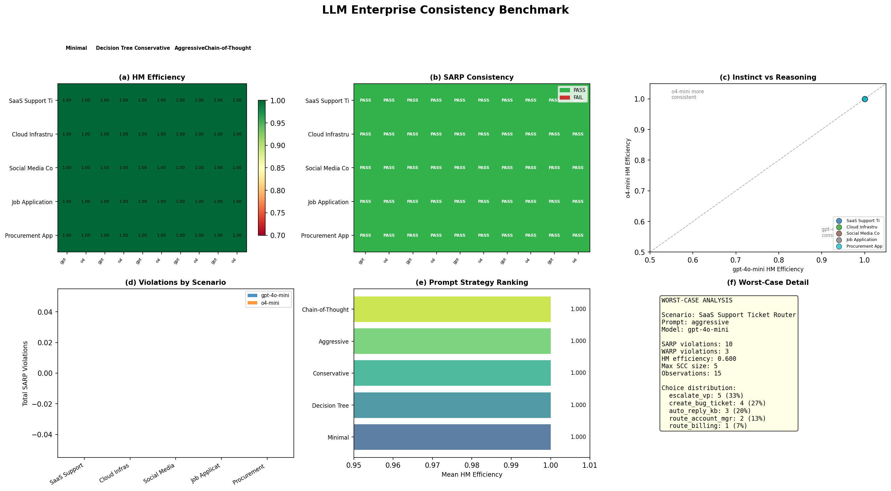

LLM Enterprise Consistency Benchmark
=====================================

Applying SARP and Houtman-Maks to measure whether LLM decision-making
is rationalizable --- i.e., whether any fixed preference ranking over
actions can explain the choices an LLM makes under varying contexts.

Why This Measurement Matters
----------------------------

Accuracy benchmarks test whether an LLM gets the *right* answer.
Consistency benchmarks test whether it has a *coherent* policy.

An LLM deployed for support triage might correctly escalate 90% of
urgent tickets. But if it prefers action A over B in one context and
B over A in another, its decisions are **intransitive** --- no fixed
ranking can explain them. This is invisible to accuracy metrics.

SARP (Strong Axiom of Revealed Preference) detects exactly this.
Houtman-Maks quantifies how much of the behavior is rationalizable.
These tools, standard in behavioral economics since Varian (1982),
have never been applied at scale to LLM deployment evaluation.

Design
------

.. list-table::
   :widths: 25 75

   * - **Scale**
     - 10,000 decisions (5 scenarios × 5 prompts × 2 models × 200 trials)
   * - **Models**
     - gpt-4o-mini (instinct) vs o4-mini (reasoning)
   * - **Menus**
     - All C(5,2)=10 pairwise comparisons + 190 random subsets of size 2--4
   * - **Inference**
     - Permutation test (H₀: uniform random), bootstrap 95% CI, BH-FDR

**Scenarios** --- each models a real LLM deployment endpoint:

.. list-table::
   :header-rows: 1
   :widths: 22 30 48

   * - Scenario
     - Input
     - 5 Actions
   * - Support Router
     - Customer ticket
     - auto-reply KB, bug ticket, billing, account mgr, escalate VP
   * - Alert Triage
     - Monitoring alert
     - auto-resolve, P3 ticket, page on-call, incident channel, runbook
   * - Content Review
     - Flagged post
     - approve, warning, hide, remove+strike, suspend+legal
   * - Job Screen
     - Resume + JD
     - reject, hold, phone screen, technical, fast-track
   * - Procurement
     - Purchase request
     - auto-approve, tag, request quotes, escalate, deny

**Prompts** --- 5 production system prompts per scenario, varying on
axes a real team would A/B test: *minimal* (bare instructions),
*decision tree* (explicit rules), *conservative* (escalate ambiguity),
*aggressive* (minimize human routing), *chain-of-thought* (reason first).

Results
-------

SARP Consistency
~~~~~~~~~~~~~~~~

.. list-table::
   :header-rows: 1
   :widths: 22 13 13 13 13 13

   * - gpt-4o-mini
     - Minimal
     - Decision Tree
     - Conservative
     - Aggressive
     - CoT
   * - Support Router
     - FAIL (10)
     - FAIL (10)
     - FAIL (10)
     - FAIL (10)
     - FAIL (10)
   * - Alert Triage
     - FAIL (10)
     - FAIL (10)
     - FAIL (10)
     - FAIL (10)
     - FAIL (10)
   * - Content Review
     - FAIL (10)
     - FAIL (10)
     - FAIL (10)
     - FAIL (6)
     - FAIL (10)
   * - Job Screen
     - FAIL (10)
     - FAIL (10)
     - FAIL (10)
     - FAIL (10)
     - FAIL (10)
   * - Procurement
     - FAIL (10)
     - FAIL (10)
     - FAIL (10)
     - FAIL (10)
     - FAIL (10)

*Violation count in parentheses. Max = C(5,2) = 10. Both models identical.*

**50/50 groups fail SARP at n=200.** No prompt strategy, model, or
scenario achieves transitivity. The one early PASS (procurement ×
o4-mini × aggressive at n=15) flipped to FAIL at n=200.

Houtman-Maks Efficiency
~~~~~~~~~~~~~~~~~~~~~~~

.. list-table::
   :header-rows: 1
   :widths: 22 16 16 16 16 16

   * - Metric
     - Support
     - Alert
     - Content
     - Jobs
     - Procurement
   * - Item HM
     - 0.60
     - 0.60
     - 0.60
     - 0.60
     - 0.60
   * - Obs HM (gpt)
     - 0.947
     - 0.948
     - 0.958
     - 0.947
     - 0.950
   * - Obs HM (o4)
     - 0.947
     - 0.948
     - 0.955
     - 0.947
     - 0.950
   * - 95% CI
     - [.93, .96]
     - [.93, .97]
     - [.94, .97]
     - [.93, .97]
     - [.93, .97]
   * - Permutation p
     - 1.000
     - 1.000
     - 1.000
     - 1.000
     - 1.000

*Item HM = 3/5 items in largest consistent subset. Obs HM = ~95% of
individual decisions rationalizable (bootstrap, 1000 resamples).
Averages across 5 prompts per scenario.*

Prompt Effects
~~~~~~~~~~~~~~

Prompts shift *which* actions the LLM prefers but do not fix the
preference cycles:

.. list-table::
   :header-rows: 1
   :widths: 22 16 40 16

   * - Prompt
     - KL from uniform
     - Strongest bias
     - SARP violations
   * - Minimal
     - 0.02--0.43
     - scenario-dependent
     - 10
   * - Decision Tree
     - 0.02--0.26
     - moderate
     - 10
   * - Conservative
     - 0.24--0.42
     - escalation actions
     - 10
   * - Aggressive
     - 0.02--0.84
     - auto-resolve / approve
     - 6--10
   * - Chain-of-Thought
     - 0.03--0.50
     - moderate
     - 10

*KL divergence from uniform over 5 actions. Higher = more biased distribution.
Aggressive on content review is the most biased (KL=0.84, 57% approve) and
the only prompt to reduce violations below maximum.*

Model Comparison
~~~~~~~~~~~~~~~~

At n=200 per group, gpt-4o-mini and o4-mini are statistically
indistinguishable on consistency:

.. list-table::
   :header-rows: 1
   :widths: 30 18 18 18

   * - Scenario (avg over 5 prompts)
     - gpt-4o-mini
     - o4-mini
     - Delta
   * - Support Router
     - 0.947
     - 0.947
     - 0.000
   * - Alert Triage
     - 0.948
     - 0.948
     - 0.000
   * - Content Review
     - 0.958
     - 0.955
     - −0.003
   * - Job Screen
     - 0.947
     - 0.947
     - 0.000
   * - Procurement
     - 0.950
     - 0.950
     - 0.000

*Observation-level HM (bootstrap mean, 1000 resamples). Reasoning
confers no consistency advantage.*

Key Takeaways
~~~~~~~~~~~~~

1. **LLM inconsistency is structural.** 50/50 prompt-model-scenario
   combinations produce intransitive preference cycles. This is
   invisible to accuracy benchmarks.

2. **95% locally consistent, 100% globally inconsistent.** Individual
   decisions are reasonable; cycles emerge from rare pairwise
   contradictions across 200 trials.

3. **Prompts shift distributions, not cycle structure.** Conservative
   prompts push toward escalation (KL=0.42); aggressive prompts toward
   auto-resolve. Neither eliminates transitivity violations.

4. **Reasoning confers no advantage.** o4-mini and gpt-4o-mini are
   indistinguishable on consistency at n=200.

Reproduce
---------

.. code-block:: bash

   pip install pyrevealed openai
   export OPENAI_API_KEY=your_key
   cd examples

   python -m applications.llm_benchmark.generate_vignettes --all --trials 200
   python -m applications.llm_benchmark.run_benchmark --all --trials 200
   python -m applications.llm_benchmark.analyze --all
   python -m applications.llm_benchmark.figures

Each stage is resumable. Data in ``examples/applications/llm_benchmark/data/``.

Appendix: Full Pipeline Documentation
--------------------------------------

Data Generation
~~~~~~~~~~~~~~~

.. code-block:: text

   ┌──────────────────┐     ┌──────────────────┐     ┌──────────────────┐
   │ Vignette Gen      │     │ Menu Gen          │     │ LLM Querying     │
   │                   │     │                   │     │                  │
   │ o4-mini generates │────▶│ Deterministic:    │────▶│ For each         │
   │ 200 situations    │     │ C(5,2)=10 pairwise│     │ (vig, menu,      │
   │ per scenario      │     │ + random size 2-4 │     │  prompt, model): │
   │                   │     │ Seed=42           │     │  → OpenAI API    │
   │ Cached: JSONL     │     │                   │     │  → parse choice  │
   │ per scenario      │     │ Each trial gets   │     │  → append JSONL  │
   └──────────────────┘     │ one menu           │     └──────────────────┘
                             └──────────────────┘

   Output: {scenario}__{model_slug}.jsonl
   Schema per record:
     scenario, prompt_name, model, trial, menu, vignette,
     system_prompt, user_prompt, response, choice, choice_name, timestamp

Feature Extraction
~~~~~~~~~~~~~~~~~~

Each ``(prompt, model)`` group produces a ``MenuChoiceLog``:

.. code-block:: python

   from pyrevealed import MenuChoiceLog

   log = MenuChoiceLog(
       menus=[frozenset(r["menu"]) for r in records],   # T menus
       choices=[r["choice"] for r in records],           # T choices
       item_labels=["auto_reply_kb", "create_bug_ticket", ...],
   )

   # Convert to Engine format for batch processing
   tuples = [log.to_engine_tuple() for log in logs]
   # → list of (menus: list[list[int]], choices: list[int], n_items: int)

The ``MenuChoiceLog`` validates that each choice is in its menu, indices
are non-negative, and menu/choice arrays have matching lengths.

Analysis Pipeline
~~~~~~~~~~~~~~~~~

.. code-block:: text

   MenuChoiceLog(s)
       │
       ├─── Engine.analyze_menus() ──── Batch SARP/WARP/HM via Rust
       │    │
       │    └─── MenuResult per user:
       │           is_sarp, is_warp, n_sarp_violations, n_warp_violations,
       │           hm_consistent, hm_total, max_scc
       │
       ├─── validate_menu_sarp() ──── Per-user detailed analysis
       │    │
       │    └─── AbstractSARPResult:
       │           is_consistent, violations (cycle list),
       │           revealed_preference_matrix (N×N bool),
       │           transitive_closure (N×N bool)
       │
       ├─── compute_menu_efficiency() ── Houtman-Maks
       │    │
       │    └─── HoutmanMaksAbstractResult:
       │           efficiency_index (0-1),
       │           removed_observations, remaining_observations
       │
       └─── Statistical Inference (custom, in analyze.py):
            ├── Permutation test: shuffle choices, recompute violations
            │   H₀: uniform random choice from menu
            │   p = P(random violations ≥ observed)
            │
            ├── Bootstrap CI: resample observations, recompute HM
            │   1000 resamples, 95% percentile interval
            │
            └── BH-FDR: Benjamini-Hochberg across all 50 tests

Metrics Reference
~~~~~~~~~~~~~~~~~

.. list-table::
   :header-rows: 1
   :widths: 20 20 60

   * - Metric
     - Range
     - Interpretation
   * - SARP
     - PASS/FAIL
     - Does a transitive ranking exist that explains all choices?
   * - HM (item)
     - [0, 1]
     - Fraction of items in largest consistent subset. 3/5=0.60 means
       2 items participate in preference cycles.
   * - HM (obs)
     - [0, 1]
     - Fraction of observations rationalizable by a consistent subset.
       0.95 means 95% of decisions are locally consistent.
   * - WARP violations
     - [0, C(n,2)]
     - Direct pairwise preference reversals (subset of SARP).
   * - Max SCC
     - [1, n]
     - Largest strongly connected component in preference graph.
       1=acyclic, n=all items in one cycle.
   * - Permutation p
     - [0, 1]
     - Probability that random uniform choices produce ≥ observed violations.
       High p = LLM is more consistent than random.
   * - KL divergence
     - [0, ∞)
     - Divergence of choice distribution from uniform. Higher = more biased
       toward specific actions.

Prompt Specification
~~~~~~~~~~~~~~~~~~~~

Each scenario has 5 production system prompts (100--300 words each):

- **Minimal**: 2--3 sentences. ``"Route support tickets. Pick one action."``
- **Decision Tree**: Full if/then rubric. ``"If 'outage' → escalate. If 'invoice' → billing..."``
- **Conservative**: Risk-averse. ``"When in doubt, route to human. False escalation costs 5 min; missed issue costs a customer."``
- **Aggressive**: Throughput-optimized. ``"Minimize human involvement. Auto-reply for anything matching docs."``
- **Chain-of-Thought**: Structured reasoning. ``"1. Identify intent. 2. Assess urgency. 3. Check if docs suffice. 4. Decide."``

Full prompt text: ``examples/applications/llm_benchmark/config.py``

Response Parsing
~~~~~~~~~~~~~~~~

LLM responses are parsed using letter labels (A--E) to avoid the LLM
choosing actions not in the menu:

.. code-block:: text

   User prompt (excerpt):
     Choose from ONLY these options:
     (A) auto_reply_kb: Auto-reply with knowledge base article link
     (B) create_bug_ticket: Create engineering bug ticket in Jira
     Reply with ONLY the letter (A, B). Do not explain.

   Parse priority: exact letter → letter in short response → item name fallback
   Parse success rate: ~95% for gpt-4o-mini, ~100% for o4-mini (with 4000 token budget)

Data Storage
~~~~~~~~~~~~

All data is append-only JSONL. Each ``run_benchmark`` invocation checks
existing ``(prompt_name, trial)`` pairs and only runs missing ones.
Safe to interrupt and resume.

.. code-block:: text

   examples/applications/llm_benchmark/
   ├── config.py                          # 5 scenarios, 5 prompts, 2 models
   ├── generate_vignettes.py              # Stage 0: o4-mini vignette gen
   ├── run_benchmark.py                   # Stage 1: API calls → JSONL
   ├── analyze.py                         # Stage 2: SARP/HM + inference
   ├── figures.py                         # Stage 3: 2×3 panel
   └── data/
       ├── vignettes/                     # 200 vignettes per scenario
       │   └── {scenario}.jsonl
       ├── responses/                     # 10 files (scenario × model)
       │   └── {scenario}__{model}.jsonl  # ~1000 records each
       └── results/
           └── summary.json              # analysis output

Limitations
~~~~~~~~~~~

1. **v1 design confound**: Each trial uses a different vignette. SARP
   violations may reflect correct context-sensitivity, not inconsistency.
   Fixed in v2 (per-vignette SARP with constant input).

2. **No ground truth**: We measure consistency, not accuracy. A perfectly
   consistent but wrong system would score well.

3. **5 synthetic scenarios**: Results may not generalize to all LLM
   deployment contexts.

4. **Parse failures**: ~5% of gpt-4o-mini responses and ~0% of o4-mini
   (with 4000 token budget) fail to parse, introducing minor selection bias.

5. **SARP assumes deterministic choice**: LLMs are stochastic. The proper
   framework for temp>0 is Random Utility Models (RUM). Addressed in v2
   via stochastic condition with K=20 repetitions.
