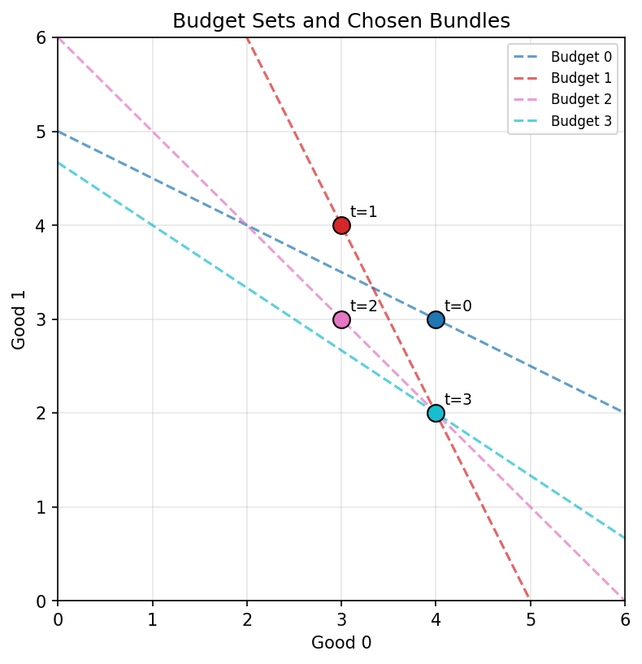
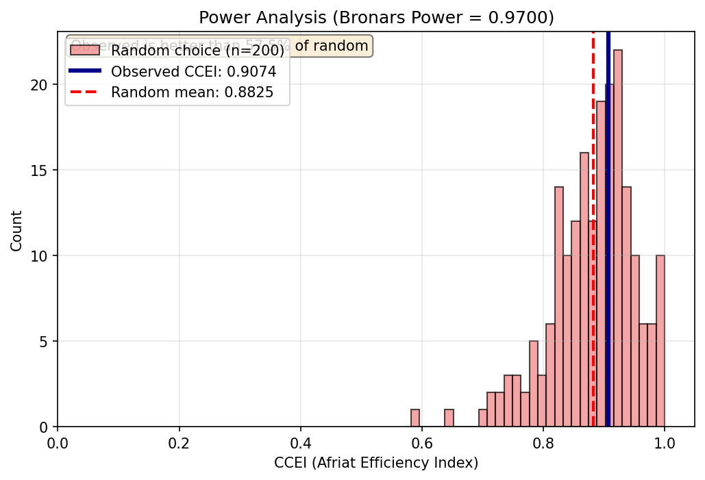
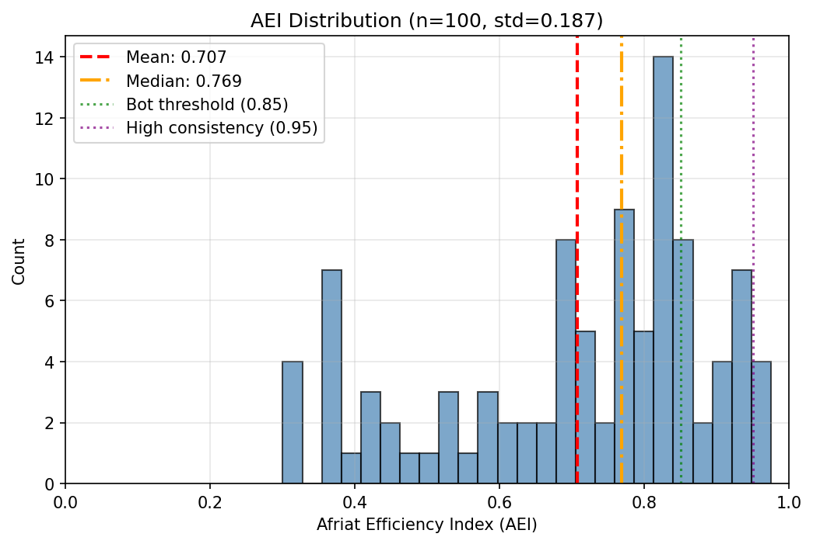
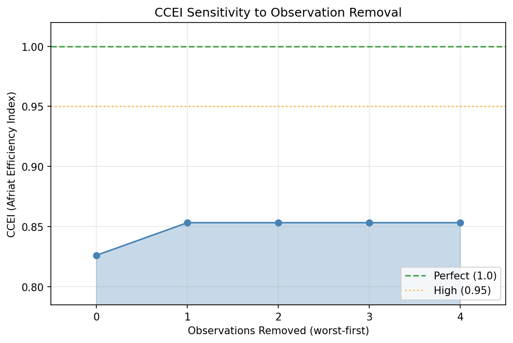

PyRevealed
==========

.. raw:: html

   Faster than R

.. raw:: html

   

   Production-ready revealed preference analysis. Test if choices are internally consistent,
   quantify behavioral consistency, and analyze decision patterns.
   

.. raw:: html

   

     

       ✓
       <h3>Consistency Testing</h3>
       
Check GARP, WARP, and SARP axioms to verify if choices could come from utility maximization.

     

     

       ◉
       <h3>Behavioral Metrics</h3>
       
Get AEI (0-1 consistency score) and MPI (welfare loss from preference cycles).

     

     

       ƒ
       <h3>Utility Recovery</h3>
       
Reconstruct utility functions that rationalize observed behavior for prediction and simulation.

     

     

       ⚙
       <h3>ML Integration</h3>
       
sklearn-compatible PreferenceEncoder for extracting behavioral features into ML pipelines.

     

     

       ☰
       <h3>Multiple Data Types</h3>
       
Budgets, menus, stochastic choice, risk choice, and production data.

     

     

       ⚡
       <h3>Production Ready</h3>
       
Fast parallel processing for thousands of users. Cross-validated against R's revealedPrefs.

     

   

Installation
------------

.. code-block:: bash

   pip install pyrevealed

For visualization support:

.. code-block:: bash

   pip install pyrevealed[viz]

Quick Example
-------------

Grocery shopping: 5 trips, 4 products (milk, bread, eggs, cheese). The consumer responds to price changes by buying more of cheaper items.

.. code-block:: python

   from pyrevealed import BehaviorLog
   import numpy as np

   # Prices and quantities for 5 shopping trips
   prices = np.array([
       [3.50, 2.00, 4.00, 6.00],  # Base prices
       [2.80, 2.50, 4.00, 5.00],  # Milk on sale
       [3.50, 1.50, 3.50, 6.50],  # Bread on sale
       [3.00, 2.00, 5.00, 4.50],  # Cheese on sale
       [4.00, 2.50, 3.00, 6.00],  # Eggs on sale
   ])
   quantities = np.array([
       [2, 3, 1, 1],  # Base purchase
       [4, 2, 1, 1],  # Buy more milk when cheap
       [2, 5, 1, 1],  # Buy more bread when cheap
       [2, 3, 1, 2],  # Buy more cheese when cheap
       [2, 2, 3, 1],  # Buy more eggs when cheap
   ])

   log = BehaviorLog(cost_vectors=prices, action_vectors=quantities)
   print(log.summary())

Output:

.. code-block:: text

   ============================================================
                        BEHAVIORAL SUMMARY
   ============================================================

   Data:
   -----
     Observations ......................................... 5
     Goods ................................................ 4

   Consistency Tests:
   ------------------
     GARP .......................................... [+] PASS
     WARP .......................................... [+] PASS
     SARP .......................................... [+] PASS

   Goodness-of-Fit:
   ----------------
     Afriat Efficiency (AEI) ......................... 1.0000
     Money Pump Index (MPI) .......................... 0.0000

   Interpretation:
   ---------------
     Excellent consistency - behavior fully rationalizable

   Computation Time: 0.08 ms
   ============================================================

This consumer's shopping behavior is perfectly consistent with utility maximization - they respond rationally to price changes.

All Data Types
--------------

PyRevealed supports 5 data types. Each provides a comprehensive ``.summary()`` report.

**1. Budget-Based Behavior (BehaviorLog)**

For consumer purchases with prices and quantities. This is the standard revealed preference setting where budget constraints determine what is affordable.

.. code-block:: python

   from pyrevealed import BehaviorLog
   import numpy as np

   # Coffee shop visits: 6 trips, 4 items (latte, cappuccino, pastry, sandwich)
   prices = np.array([
       [5.00, 4.50, 3.00, 8.00],  # Regular prices
       [4.00, 4.50, 3.00, 8.00],  # Latte discount
       [5.00, 3.50, 3.00, 8.00],  # Cappuccino discount
       [5.00, 4.50, 2.00, 8.00],  # Pastry discount
       [5.00, 4.50, 3.00, 6.00],  # Sandwich discount
       [4.50, 4.00, 2.50, 7.00],  # Everything 10% off
   ])
   quantities = np.array([
       [1, 1, 1, 0],  # Two drinks + pastry
       [2, 0, 1, 0],  # More lattes when cheap
       [0, 2, 1, 0],  # More cappuccinos when cheap
       [1, 1, 2, 0],  # More pastries when cheap
       [1, 0, 1, 1],  # Add sandwich when cheap
       [1, 1, 2, 0],  # General savings -> more pastries
   ])

   log = BehaviorLog(cost_vectors=prices, action_vectors=quantities)
   print(log.summary())

.. code-block:: text

   ============================================================
                        BEHAVIORAL SUMMARY
   ============================================================

   Data:
   -----
     Observations ......................................... 6
     Goods ................................................ 4

   Consistency Tests:
   ------------------
     GARP .......................................... [+] PASS
     WARP .......................................... [+] PASS
     SARP .......................................... [+] PASS

   Goodness-of-Fit:
   ----------------
     Afriat Efficiency (AEI) ......................... 1.0000
     Money Pump Index (MPI) .......................... 0.0000

   Interpretation:
   ---------------
     Excellent consistency - behavior fully rationalizable

   Computation Time: 0.09 ms
   ============================================================

**2. Menu-Based Choice (MenuChoiceLog)**

For discrete choices from menus without prices. Common in experiments and surveys where participants choose from option sets.

.. code-block:: python

   from pyrevealed import MenuChoiceLog

   # Restaurant menu choices: 6 visits, 4 dishes (pasta, steak, salad, fish)
   menus = [
       frozenset({0, 1, 2, 3}),  # Full menu
       frozenset({0, 1, 2}),     # No fish today
       frozenset({0, 2, 3}),     # No steak today
       frozenset({1, 2, 3}),     # No pasta today
       frozenset({0, 1}),        # Limited: pasta or steak
       frozenset({2, 3}),        # Limited: salad or fish
   ]
   choices = [1, 1, 0, 1, 1, 3]  # Prefers steak > pasta > fish > salad

   log = MenuChoiceLog(menus, choices)
   print(log.summary())

.. code-block:: text

   ============================================================
                     MENU CHOICE SUMMARY
   ============================================================

   Data:
   -----
     Observations ......................................... 6
     Alternatives ......................................... 4

   Consistency Tests:
   ------------------
     WARP .......................................... [+] PASS
     SARP .......................................... [+] PASS
     Congruence .................................... [+] PASS

   Goodness-of-Fit:
   ----------------
     Houtman-Maks Efficiency ......................... 1.0000

   Preference Order:
   -----------------
     1 > 0 > 3 > 2

   Computation Time: 0.06 ms
   ============================================================

**3. Risk Choice (RiskChoiceLog)**

For choices between safe and risky options. Reveals risk attitudes and tests Expected Utility axioms.

.. code-block:: python

   from pyrevealed import RiskChoiceLog
   import numpy as np

   # Insurance decisions: 8 scenarios with varying premiums and coverage
   safe_values = np.array([40, 45, 50, 55, 60, 65, 70, 75])  # Certain payoff
   risky_outcomes = np.array([
       [0, 100], [0, 100], [0, 100], [0, 100],
       [0, 120], [0, 120], [0, 140], [0, 140],
   ])  # Risky lottery outcomes
   risky_probs = np.array([[0.5, 0.5]] * 8)  # 50-50 chance

   # Risk-averse: prefers safe when expected values are close
   choices = np.array([False, False, False, True, False, True, False, True])

   log = RiskChoiceLog(safe_values, risky_outcomes, risky_probs, choices)
   print(log.summary())

.. code-block:: text

   ============================================================
                       RISK CHOICE SUMMARY
   ============================================================

   Data:
   -----
     Observations ......................................... 8
     Risk-Seeking Choices ................................. 3
     Risk-Averse Choices .................................. 5

   Risk Profile:
   -------------
     Risk Category .............................. Risk Averse
     Risk Aversion (rho) ............................. 0.8594
     Consistency Score ............................... 1.0000

   Expected Utility Axioms:
   ------------------------
     Status ...................................... [+] SATISFIED

   Interpretation:
   ---------------
     Decision-maker prefers certainty over gambles.
     Certainty premium: willing to accept ~45% less for certainty.

   Computation Time: 0.21 ms
   ============================================================

**4. Stochastic Choice (StochasticChoiceLog)**

For probabilistic choices with observed frequencies. Tests Random Utility Model consistency.

.. code-block:: python

   from pyrevealed import StochasticChoiceLog

   # Product catalog: 4 menus, ~100 observations each
   # Items: 0=Basic, 1=Standard, 2=Premium, 3=Deluxe
   menus = [
       frozenset({0, 1, 2, 3}),  # Full catalog
       frozenset({0, 1, 2}),     # No deluxe
       frozenset({1, 2, 3}),     # No basic
       frozenset({0, 1}),        # Budget options only
   ]
   choice_frequencies = [
       {0: 10, 1: 30, 2: 40, 3: 20},  # Premium most popular
       {0: 15, 1: 35, 2: 50},          # Premium still top
       {1: 25, 2: 45, 3: 30},          # Premium still top
       {0: 30, 1: 70},                 # Standard beats basic
   ]

   log = StochasticChoiceLog(menus, choice_frequencies)
   print(log.summary())

.. code-block:: text

   ============================================================
                    STOCHASTIC CHOICE SUMMARY
   ============================================================

   Data:
   -----
     Menus ................................................ 4
     Unique Items ......................................... 4
     Total Observations ................................. 400

   Consistency Tests:
   ------------------
     RUM Consistency .............................. [+] PASS
     Regularity (Luce) ............................ [+] PASS
     IIA .......................................... [+] PASS

   Stochastic Transitivity:
   ------------------------
     Weak (WST) ................................... [+] PASS
     Moderate (MST) ............................... [+] PASS
     Strong (SST) ................................. [+] PASS

   Interpretation:
   ---------------
     Choices can be rationalized by a random utility model.
     Strongest transitivity: SST

   Computation Time: 0.15 ms
   ============================================================

**5. Production/Firm (ProductionLog)**

For firm behavior with inputs and outputs. Tests profit maximization and cost minimization.

.. code-block:: python

   from pyrevealed import ProductionLog
   import numpy as np

   # Manufacturing plant: 5 periods, 3 inputs (labor, capital, materials)
   input_prices = np.array([
       [20, 50, 10],  # Base input prices
       [22, 45, 10],  # Labor up, capital down
       [18, 55, 10],  # Labor down, capital up
       [20, 50, 8],   # Materials cheaper
       [20, 50, 12],  # Materials expensive
   ])
   input_quantities = np.array([
       [100, 40, 200],  # Base production
       [90, 45, 200],   # Substitute away from labor
       [110, 35, 200],  # Substitute away from capital
       [100, 40, 250],  # Use more materials
       [100, 40, 150],  # Use less materials
   ])
   output_prices = np.array([[100], [100], [100], [100], [100]])
   output_quantities = np.array([[50], [48], [49], [55], [45]])

   log = ProductionLog(input_prices, input_quantities, output_prices, output_quantities)
   print(log.summary())

.. code-block:: text

   ============================================================
                      PRODUCTION SUMMARY
   ============================================================

   Data:
   -----
     Observations ......................................... 5
     Inputs ............................................... 3
     Outputs .............................................. 1

   Consistency Tests:
   ------------------
     Profit Maximization .......................... [+] PASS
     Cost Minimization ............................ [+] PASS

     Returns to Scale ......................... Increasing

   Efficiency Metrics:
   -------------------
     Technical Efficiency ........................... 1.0000
     Cost Efficiency ................................ 1.0000
     Profit Efficiency .............................. 1.0000

   Interpretation:
   ---------------
     Firm behavior is consistent with profit maximization.
     Returns to scale: increasing.
     Operating at 100.0% of optimal profit efficiency.

   Computation Time: 0.18 ms
   ============================================================

Power Analysis (Optional)
-------------------------

For rigorous analysis, include power analysis to assess how meaningful your test results are:

.. code-block:: python

   from pyrevealed import BehaviorLog
   import numpy as np

   # Same grocery shopping data
   prices = np.array([
       [3.50, 2.00, 4.00, 6.00],
       [2.80, 2.50, 4.00, 5.00],
       [3.50, 1.50, 3.50, 6.50],
       [3.00, 2.00, 5.00, 4.50],
       [4.00, 2.50, 3.00, 6.00],
   ])
   quantities = np.array([
       [2, 3, 1, 1],
       [4, 2, 1, 1],
       [2, 5, 1, 1],
       [2, 3, 1, 2],
       [2, 2, 3, 1],
   ])

   log = BehaviorLog(cost_vectors=prices, action_vectors=quantities)
   print(log.summary(include_power=True))

The power analysis section shows:

- **Bronars Power**: Probability that random behavior would fail GARP (higher = more demanding test)
- **Optimal Efficiency (e*)**: Efficiency level that maximizes predictive success
- **Optimal Measure (m*)**: Maximum predictive success value

Visualizations
--------------

PyRevealed includes built-in visualizations for analysis and reporting.

.. raw:: html

   

.. raw:: html

   

Core Functions
--------------

.. list-table::
   :header-rows: 1
   :widths: 40 35 25

   * - Function
     - Returns
     - Score Meaning
   * - ``validate_consistency(log)``
     - ``bool``
     - True = rational
   * - ``compute_integrity_score(log)``
     - ``AEIResult`` (0-1)
     - 1 = perfect
   * - ``compute_confusion_metric(log)``
     - ``MPIResult`` (0-1)
     - 0 = no cycles
   * - ``fit_latent_values(log)``
     - ``UtilityRecoveryResult``
     - Utility values
   * - ``compute_minimal_outlier_fraction(log)``
     - ``HoutmanMaksResult`` (0-1)
     - 0 = all consistent

.. note::
   **Quick interpretation**: Integrity >=0.95 is excellent, >=0.90 is good, <0.70 indicates problems.
   Confusion <0.05 is very low, >0.15 indicates significant preference cycles.

.. toctree::
   :maxdepth: 1
   :hidden:

   installation
   quickstart
   tutorials
   theory
   api
   scaling
   validation
   troubleshooting
   case_study
   references

----

Based on `Chambers & Echenique (2016) <https://www.amazon.com/Revealed-Preference-Econometric-Society-Monographs/dp/1107087805>`_.
Validated against R's `revealedPrefs <https://cran.r-project.org/package=revealedPrefs>`_ package. See :doc:`validation`.
